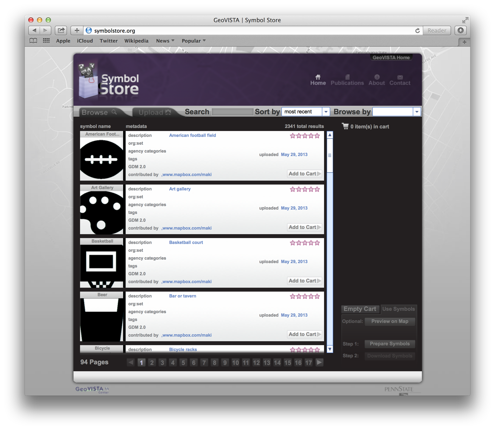
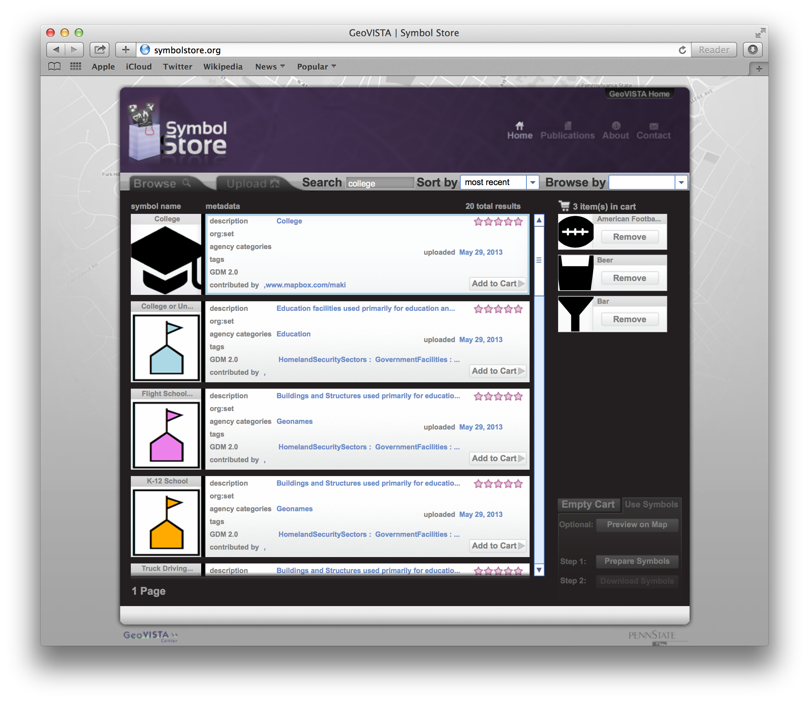
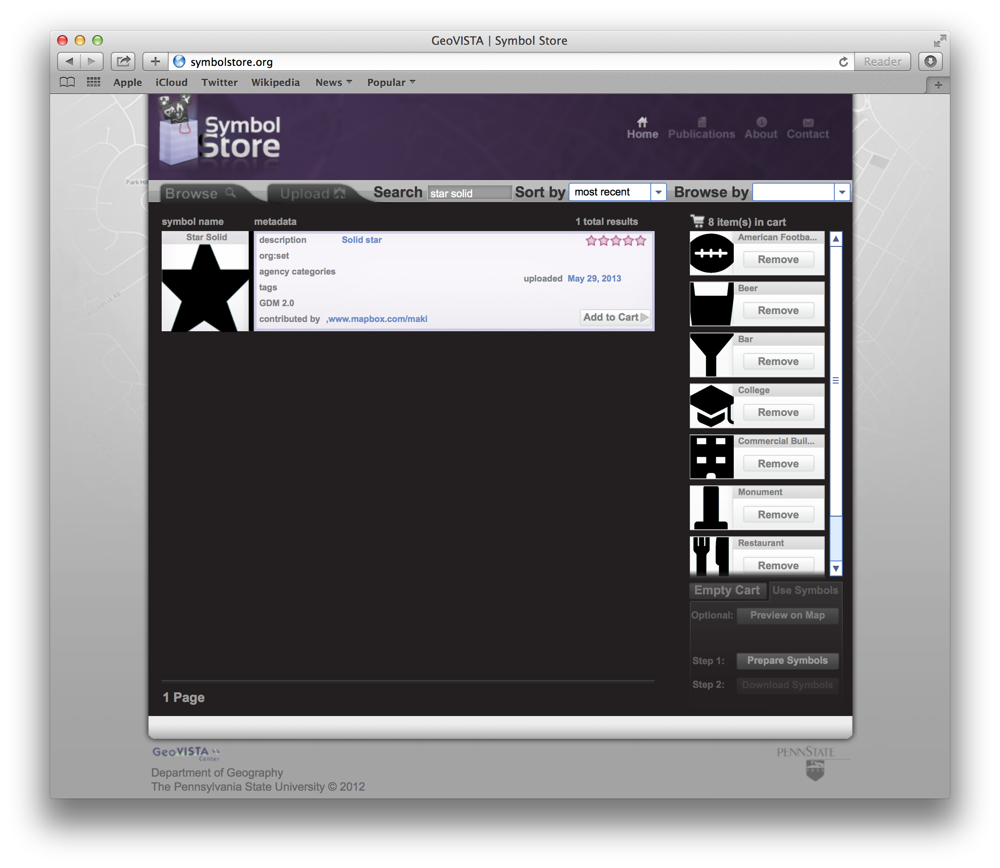
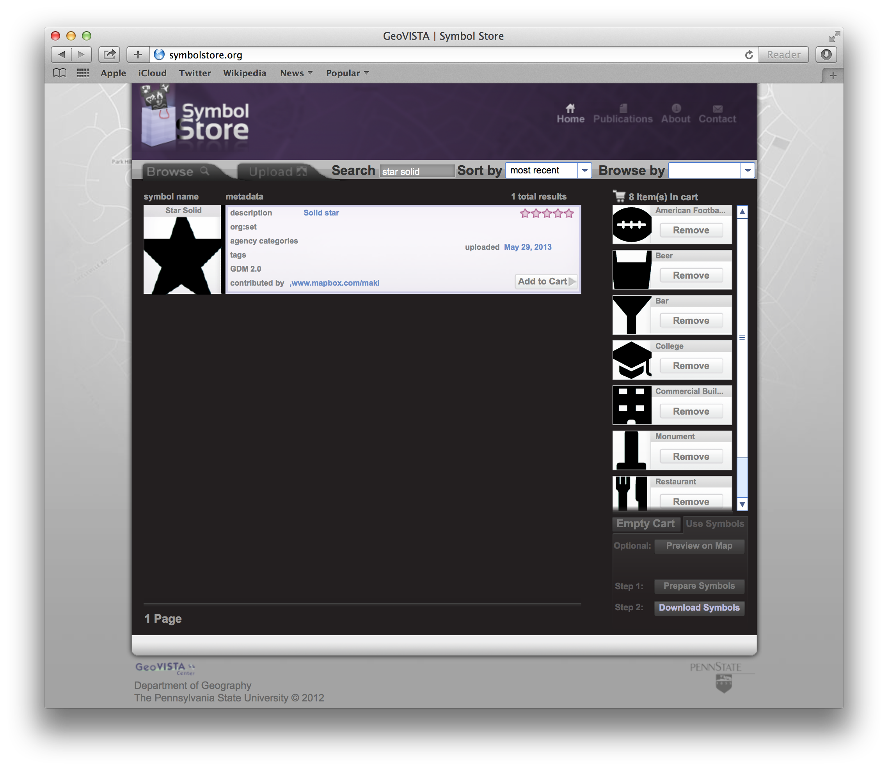

Using the SymbolStore to Create a Stand-Alone Web Map
=====================================================

Ryan S Mullins    
GeoVISTA Center    
The Pennsylvania State University

# Background

The [SymbolStore](http://symbolstore.org) is an online repository of some 2300 symbols (and growing) that can be and are used to represent point features on maps, among other uses. This tutorial is designed to show you, as a map maker, how to use the SymbolStore to create a self-hosted or otherwise stand-alone web map.

### Required Skills and Tools

There are several skills and tools that you will need to complete this tutorial. 

**Skills**

* Experience with web maps (e.g. [Google Maps](http://maps.google.com) or [Open Street Map](http://osm.org))
* Some experience with [HTML](http://en.wikipedia.org/wiki/Html)
* Some experience with [JavaScript](http://en.wikipedia.org/wiki/JavaScript)
* Some experience with the [Leaflet.js](http://leaflet.com) mapping library
* Some knowledge of [HTTP](http://en.wikipedia.org/wiki/Hypertext_Transfer_Protocol) requests and [RESTful APIs](http://en.wikipedia.org/wiki/RESTful)
* Some knowledge of the [GeoJSON data specification](http://geojson.org/geojson-spec.html) 

**Tools** 

* A text editor &mdash; Everybody likes there own editor for [different reasons](http://xkcd.com/378/), so if you have a thing for `vim` or `emacs` or something else go right ahead and use it. If you have yet to find a text editor of your own, I suggest trying out [Sublime Text](www.sublimetext.com). 
* A browser &mdash; I like to use [Chrome](http://www.google.com/chrome), you may prefer [Firefox](http://www.mozilla.org/firefox) or [Safari](http://www.apple.com/safari/). All I ask is that you don't use Internet Explorer; I don't use it, I didn't test this on it, and I make no promises that any of this will work if you do.
* [Git](https://help.github.com/articles/set-up-git) (optional) &mdash; A popular revision control system and the reason for GitHub, if you haven't installed it already now would be a good time.
* A web server (optional) &mdash; You don't really need this for the tutorial I present here, but if you want to use an [Apache](http://httpd.apache.org/) or [nginx](http://wiki.nginx.org/Main) server during your development process it won't hurt. 


# Creating a Web Map Using the SymbolStore and Leaflet.js

## Step 0: Getting the Starter Code

The first step, as with any project, is to create a workspace for your project. I have provided a directory structure with some code for this demo that will do just that. All you need to do is get this code onto your computer. 

### Downloading a .zip Archive

The easiest way to get the source code is to download a .zip archive of this repository. On the repository [home page](https://github.com/RyanMullins/Tutorial-SymbolStoreClassic) you will see a button that reads "Download Zip". Simply click that and this entire tutorial will be downloaded to your hard drive. 

### Cloning the Git Repository

A second option is to use Git to clone the repository to your system. There are many ways to do this with the various command line and graphical interfaces currently available, but I will demonstrate the simplest command line version below.

```Shell
$ git clone https://github.com/RyanMullins/Tutorial-SymbolStoreClassic.git
```

## Step 1: Exploring the Starter Code

With code in hand (so to speak) you can now start getting some work done. But before you get too deep down that rabbit hole, let's take a look a t what i have provided for you. 

In the repository you will find a few directories, the important ones here are _src_ and _final_. These directories are, for the most part, copies of one another. The _final_ directory is what I used to create this tutorial, and it includes a complete working copy of the map that you are trying to build. Use this directory as a reference when you get stuck, it's pretty well documented. 

The _src_ directory is a workspace I have created for you. Inside this directory you will find three other directories and a file. The _styles_ directory contains a single CSS file used to style the map, you shouldn't ever need to touch this. The _images_ directory will be discussed later in this tutorial, but its purpose is exactly what you think it might be. The two important pieces right now are the file, _map.html_, and the _data_ directory. Let's take a look at these in more detail. 

### The Map

The _map.html_ file is the page that will display the map you are looking to make. Since the focus of this demo isn't as much on writing JavaScript to make a map as it is on using the SYmbolStore to customize your map's symbology, I have provided the complete, working code to get a map on the page. Let's take a quick look at the body of the _map.html_ file, listed below. 

```HTML
<body>
    <div id="title">
        <h1>10 Things to do on PSU Homecoming Weekend</h1>
    </div>
    <div id="map"></div>
    <script type="text/javascript">
        // ---- Map ----
        
        var map = L.map('map', {
            'center' : [40.802139, -77.8611974],
            'zoom' : 14,
            'maxZoom' : 18,
            'minZoom' : 14,
            'maxBounds' : new L.LatLngBounds(
                new L.LatLng(40.78262115769851, -77.88697242736815), 
                new L.LatLng(40.82160395916235, -77.83547401428223))
        });

        // ---- Tiles for Base Map ----

        L.tileLayer('http://acetate.geoiq.com/tiles/acetate-hillshading/{z}/{x}/{y}.png', {
           attribution: 'Map data &copy; <a href="http://openstreetmap.org">OpenStreetMap</a> contributors, <a href="http://creativecommons.org/licenses/by-sa/2.0/">CC-BY-SA</a>, Imagery &copy; <a href="http://FortiusOne.com">FortiusOne</a> and <a href="http://stamen.com">Stamen</a>',
           maxZoom: 18
        }).addTo(map);

        // ---- Load and Display the Data ----

        $.getJSON('data/data.json', function (data) {
            L.geoJson(data, {
                'onEachFeature' : function (feature, layer) {
                    layer.bindPopup(
                        "<b>" + feature.properties.name + "</b><br/>" +
                        "Rank &ndash; " + feature.properties.rank + "<br/>" +
                        "Description &ndash; " + feature.properties.description);
                }, 
                'pointToLayer' : function (feature, latlng) {
                    return L.marker(
                        latlng,
                        {
                            icon: L.icon({
                                iconUrl: feature.properties.symbol,
                                iconSize: [20,20]
                            }),
                            title: feature.properties.name
                        });
                }
            }).addTo(map);
        });
    </script>
</body>
```

As you can see, the body of the page is comprised of three elements &mdash; a `div` called title, a `div` called map, and a piece of JavaScript. The title div is exactly that. The map div is empty, but will be populated with content by the Leaflet.js mapping library. The JavaScript is where things get interesting. 

This script is broken into three sections &mdash; making a map, adding tiles to that map, and adding data to the map. 

In the first section, I use the Leaflet Map function to create a map in the map `div`. I limit this map's extents to an area over State College, PA and University Park, PA. I also limit and set the zoom level so that the user can't get lost. 

In the next section I create a tile layer that will be the base map for this application. These tiles were designed by fine folks at [GeoIQ](http://www.geoiq.com) as part of their Acetate line of analytical products. They are a nice set of simple tiles that look good with a variety of symbol types. Of course, if you have a favorite set feel free to swap them out. 

The last section is where the meat and potatoes are. I use the [jQuery](http://jquery.com) library's `getJSON` function to load in a static GeoJSON file from the _data_ directory. Once this file is loaded it is passed to the Leaflet.js library's `geoJson` function, which parses this data and adds the features to the map. I also use two options in this function to customize the appearance of these features. The first option, `onEachFeature`, allows me to give each of these features a custom pop-up (displayed on click) that has the name of the location and a brief description of what a person can do there. The second option, `pointToLayer`, is where I define the custom Markers for these features. Inside this function I return a new Leaflet Marker with a custom defined Icon using links to symbols I provide with the data. 

And speaking of data...

### The Data

I like to have a theme to my maps and demos, and being that it was Homecoming at Penn State last weekend (12 Oct 2013, we played Michigan, we won, it was intense) I decided to make a map of "10 Things to do on PSU Homecoming Weekend". So, I made a list of ten classic Penn State Homecoming activities, which became the data behind this map.

In the _data_ directory you will find a single file, _data.json_. This file is contains a [GeoJSON](http://geojson.org/geojson-spec.html) [Feature Collection](http://geojson.org/geojson-spec.html#feature-collection-objects), with a list of [Point Features](http://geojson.org/geojson-spec.html#point). Each feature has geometry for the location of that activity, and a few of properties. I provide properties that give the name, (arbitrary) rank, and description of the activity and location. I also provide a fourth property, _symbol_, that is a string containing the URI to the custom symbol you will download from the SymbolStore. 

## Step 2: Getting Symbols from the SymbolStore

Now it's time to get a collection of symbols to use in this map. In the provided data you will find the following types of activities/places:

* Sporting Event (football game)
* Monument (Lion Shrine)
* Building (Old Main)
* Restaurant/Bar (The Tavern, The Corner Room, the Waffle Shop, Cafe 210 West)
* Entertainment (parade, tailgating, live radio broadcast)

You will need a symbol for each types of activity/place, so head on over to [SymbolStore.org](http://symbolstore.org) and start browsing around. 

### Finding and Adding Symbols to Your Cart

Welcome to the SymboStore, one of the largest repositories of map symbols on the web. Figure 1, below, shows the interface that you will be greeted with when the page first loads. 



When the page first loads you are presented with a list of the first 25 symbols in the repository, ordered alphabetically by name. On the right you will notice a blank area with some buttons below, this is your cart and will be where you store the symbols you want before downloading them.

Speaking of downloading symbols... You have 5 types of activities on this map, each requiring at least one symbols. Now you can search for some symbols you would like to use to represent these activities. I'll walk you through the process for one symbol, then you can keep going with the rest. 

Let's start by finding a symbol to use for the building. The building I have included in the data is Old Main, the main administrative building at Penn State. Since it is the center of university, I think it would be appropriate to look for a symbol that represents a school or college. I decided to try and search for the word college, and got some decent results (see Figure 2).



Of the symbols that match the word "college" I like the first one the best. It is from the [Maki](http://mapbox.com/maki) symbol set developed by MapBox and I tend to gravitate towards the simple designs from this set. Now, I simply click the "Add to Cart" button and the symbol is added to my cart. 

You can use the search bar to look up symbols for the rest of the activities on the list, adding the ones you like to your cart. I kept with the Maki symbols for my map &ndash; American Football, Bar, Beer, College, Monument, Restaurant, Star (Solid). 

### Downloading, Unpacking, and Moving Symbols

After you finish adding your symbols to your cart, you need to tell the SymbolStore to prepare a download for you. Because of the diverse client base the SymbolStore supports, downloads include three symbol formats &ndash; PNG, SVG, and Esri Style Files. When you click on the "Prepare Symbols" button (see Figure 3) the SymbolStore generates the Style File, and creates a .zip archive of that new Style File, the PNGs, the SVGs and any licensing information for those symbols. 



After the archive is ready for download the "Download" button will be enabled (see Figure 4). Click that and the archive will be saved to your computer. 



Unzip the archive you just downloaded, it's time to go exploring and move some things around. Inside the extracted folder you will find two other directories &ndash; "image" and "svg" &ndash; and the Esri Style File. In this tutorial you'll use the PNG images, so open up that directory. You'll see that the images are separated by origin set (Maki, DHS, FEMA, etc.) and inside those folder you are provided with square symbols in four sizes &ndash; 16px, 32xp, 64px, 100px. Select all the 100px images and copy those into the _src/images_ folder in your tutorial workspace. At this point you can either delete this download or keep it around, but we will not be coming back to it. 

## Step 3: Altering the Data

Time to go back to your data. As we discussed previously, the data is a GeoJSON Feature Collection of Point Features. Each of these features has a set of properties, one of those properties is the _symbol_ property. Right now this property is blank (see example below) but you will be populating it with a link to the symbol that will represent that Feature. 

```JavaScript
{
    "type"     : "FeatureCollection",
    "features" : [
        {
            "type"       : "Feature",
            "geometry"   : {
                "type"        : "Point",
                "coordinates" : [-77.8533986, 40.8118233]
            },
            "properties" : {
                "name"        : "Nittany Lion Football at Beaver Stadium",
                "rank"        : 1,
                "description" : "The Greatest Show on Earth!",
                "symbol"      : ""
            }
        },
        ...
    ]
}
```

The link you will use is a relative link, meaning that it is the path from the current location in the file system to the location of that resource. In this case, the images will be loaded from the main web page, which is in the _src_ directory in your workspace. The symbols you are using should be stored in the _src/images_ directory, so you link will look something like "images/{symbol_name}.png" where you will change the _{symbol_name}_ based on the symbol you want to use. 

```JavaScript
{
    "type"     : "FeatureCollection",
    "features" : [
        {
            "type"       : "Feature",
            "geometry"   : {
                "type"        : "Point",
                "coordinates" : [-77.8533986, 40.8118233]
            },
            "properties" : {
                "name"        : "Nittany Lion Football at Beaver Stadium",
                "rank"        : 1,
                "description" : "The Greatest Show on Earth!",
                "symbol"      : "images/Bar_100.png"
            }
        },
        ...
    ]
}
```

Go through your data and change the value of the _symbol_ property of each Feature to reference the symbols. An example is given in the listing above if you get confused. Once these values are changed, save your work and you should be ready to go. 

## Step 4: Try It Out!

Time to try things out. Open the _index.html_ file in a browser, it should show a simple Leaflet map, centered over University Park, PA, and displaying 10 symbols you can interact with. In some browsers (Chrome) this may violate the same origin policy. If it does, copy your workspace into the active directory of a web server and try again, it should work. If your problems are persistent then please submit a bug report as it is probably my fault. 


_**Disclaimer**_

_This material is based upon work supported by the U.S. Department of Homeland Security. Any opinions, findings, conclusions or recommendations expressed in this material are those of the author(s) and do not necessarily reflect the views of funding agencies._
